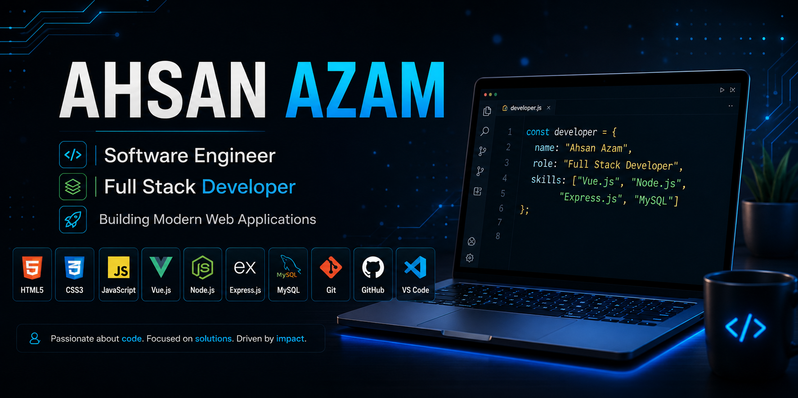

  

<h1 align="center">Hi 👋, I'm Ahsan Azam</h1>

<h3 align="center">
Software Engineer • Full Stack Developer • MS Computer Science Student
</h3>

  

---

  

  

  

  

---

# 👨‍💻 About Me

- 🎓 Software Engineering Graduate
- 🎓 Currently pursuing **MS Computer Science** at **UET Mardan**
- 💻 Passionate about **Full Stack Web Development**
- 🌱 Currently learning **Vue.js, Node.js, Express.js, and MySQL**
- 🚀 Building modern web applications
- 🎯 Goal: Become a Professional Full Stack Developer and contribute to Open Source

---

# 🚀 Current Focus

- 🔥 Building REST APIs using Node.js
- ⚡ Learning Vue.js 3
- 📚 Improving Backend Development
- 🗄️ Database Design with MySQL
- 🌍 Building Real-World Projects

---

# 🛠 Tech Stack

## 🌐 Frontend

  

## ⚙ Backend

  

## 🗄 Database

  

## 🛠 Tools

  

---

## 🌐 Portfolio Website

A modern personal portfolio showcasing my projects, technical skills, and experience.

**Tech Stack**

`Vue.js` • `Bootstrap` • `Vite`

---

## 🏫 School Management System

A complete web-based school management application.

### Features

- Student Management
- Teacher Management
- Attendance
- Courses
- Authentication

**Frontend**

`Vue.js`

**Backend**

`Node.js` • `Express.js`

**Database**

`MySQL`

---

## 🎯 Currently Building

- 🚀 REST APIs with Node.js
- ⚡ Vue.js Applications
- 🔐 Authentication Systems
- 📊 MySQL Database Design

---

## 🔗 REST API Backend

REST APIs developed using **Node.js**, **Express.js**, and **MySQL**.

---

# 📊 GitHub Analytics

  

  

  

  

---

# 🏆 GitHub Achievements

  

---

# ⚡ Fun Facts

- 💻 I enjoy building Full Stack Applications.
- 🚀 I love learning new technologies.
- ☕ Coffee makes debugging easier.
- 🌍 My goal is to build products that solve real-world problems.

---

# 📫 Let's Connect

  

  

  

  

---

# 👀 Visitors

  

---

<h3 align="center">
⭐ Thanks for visiting my profile! ⭐
</h3>

If you like my work, consider giving a ⭐ to my repositories.

